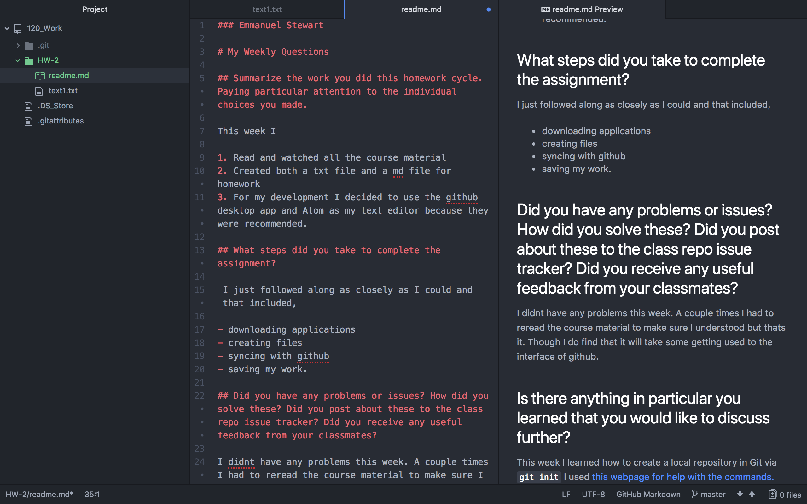

### Emmanuel Stewart

# My Weekly Questions

## Summarize the work you did this homework cycle. Paying particular attention to the individual choices you made.

This week I

1. Read and watched all the course material
2. Created both a txt file and a md file for homework
3. For my development I decided to use the github desktop app and Atom as my text editor because they were recommended.

## What steps did you take to complete the assignment?

 I just followed along as closely as I could and that included,

- downloading applications
- creating files
- syncing with github
- saving my work.

## Did you have any problems or issues? How did you solve these? Did you post about these to the class repo issue tracker? Did you receive any useful feedback from your classmates?

I didnt have any problems this week. A couple times I had to reread the course material to make sure I understood but thats it. Though I do find that it will take some getting used to the interface of github.

## Is there anything in particular you learned that you would like to discuss further?

This week I learned how to create a local repository in Git via `git init`
I used [this webpage for help with the commands.](https://confluence.atlassian.com/bitbucketserver/basic-git-commands-776639767.html)

## What issues did you help your fellow classmates out with this past homework cycle?

I couldnt find any issues this week, only one about office hours. But I cant help with that being that Im in Florida.

