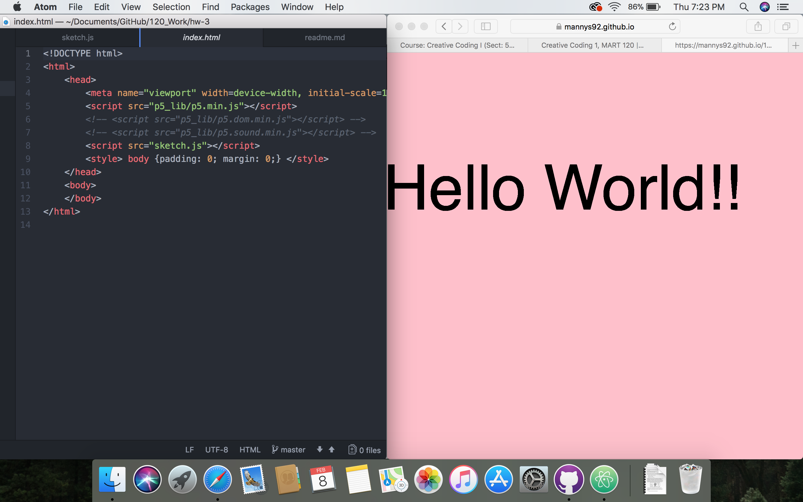

Emmanuel Stewart

[Hello World Sketch](https://mannys92.github.io/120_Work/hw-3/)

This HW Cycle, I followed along with the lesson, and that is what I am turning in for the HW. I didnt really run into trouble, there were a couple times, I noticed my code wasnt working. But I was able to figure out what was wrong on my own. My problem was that my github webpage wouldnt show up, but it was because my folder wasnt in the right place. I figured out by just using logic and retracing my steps.

I took an interactive media class where we learned processing, but that was a while ago and I dont quite remember everything, so this class is reminding me of that stuff and Im having so much fun!
There wernt any questions on  Github that I was an

Preview of Hellow World Sketch

